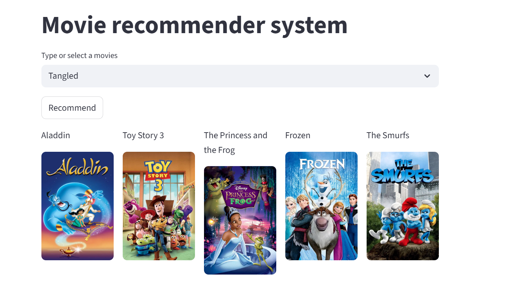

# Movie_recommender

A Machine Learning–powered Movie Recommender System built with Python, Streamlit, and TMDB API. This app allows users to get movie recommendations based on similarity and view posters in an interactive web interface.
# Screenshots

# How it Works
A similarity matrix is computed using movie features (e.g., genres, descriptions)
The app finds movies most similar to the selected movie
Recommended movies and their posters are displayed interactively
